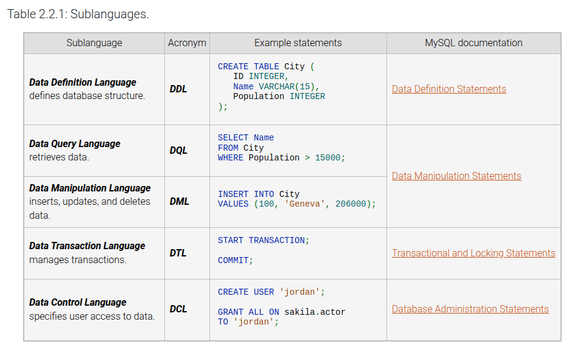

# Module 2 Learning Notes

Comments: `--` and `/*  */`

Keywords UPPERCASE is a common convention

Navigating the dbms:
- `SHOW databases;` `CREATE DATABASE <name>;`
- `SHOW tables;`
- `USE <database>;` means the commands that follow will operate on that database.

Creating tables:
- `CREATE TABLE <tableName>( columnName dataType, columnName, dataType );`
- Tables and their columns can be modified/altered after with `ALTER TABLE`, then `MODIFY COLUMN` to change datatype or `CHANGE COLUMN` to change name
- `DROP <database>` will drop from the mysql entirely.

SQL Datatypes:
A data type is a named set of values from which column values are drawn. In relational databases, most data types fall into one of the following categories:

- `Integer` data types represent positive and negative integers. Several integer data types exist, varying by the number of bytes allocated for each value. Common integer data types include INT, implemented as 4 bytes of storage, and SMALLINT, implemented as 2 bytes.
- `Decimal` data types represent numbers with fractional values. Decimal data types vary by number of digits after the decimal point and maximum size. Common decimal data types include FLOAT and DECIMAL.
- `Character` data types represent textual characters. Common character data types include CHAR, a fixed string of characters, and VARCHAR, a string of variable length up to a specified maximum size.
- `Date and time` data types represent date, time, or both. Some date and time data types include a time zone or specify a time interval. Some date and time data types represent an interval rather than a point in time. Common date and time data types include DATE, TIME, DATETIME, and TIMESTAMP.
- `Binary` data types store data exactly as the data appears in memory or computer files, bit for bit. The database manages binary data as a series of zeros and ones. Common binary data types include BLOB, BINARY, VARBINARY, and IMAGE.
- `Spatial` data types store geometric information, such as lines, polygons, and map coordinates. Examples include POLYGON, POINT, and GEOMETRY. Spatial data types are relatively new and consequently vary greatly across database systems.
- `Document` data types contain textual data in a structured format such as XML or JSON.
