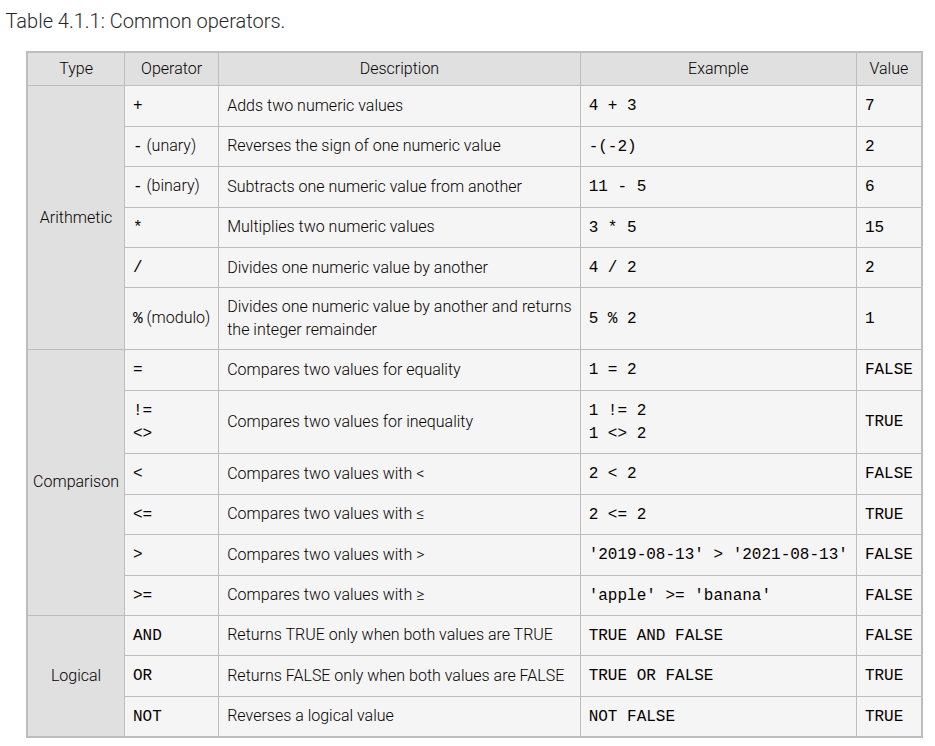
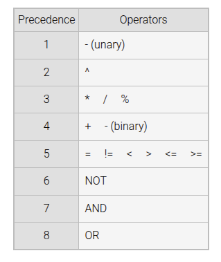
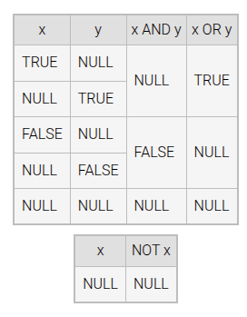
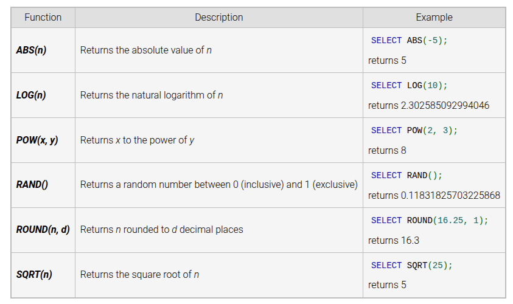
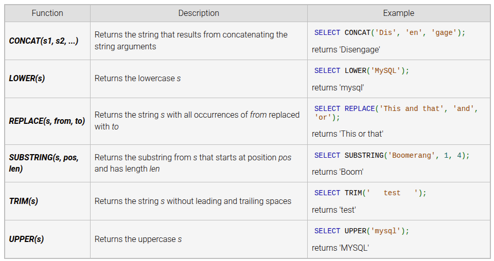
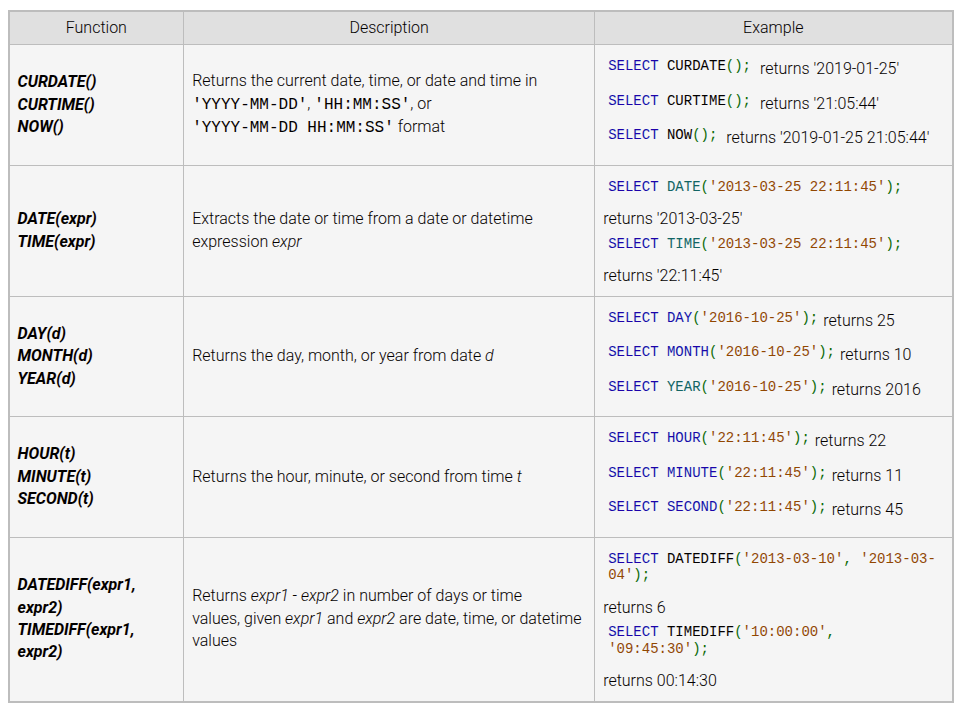

# Module 3 notes

Boolean/Arithmetic operators and things:

Operators on the same level go left to right in evaluation, otherwise it is
top to bottom.

NULL values operate with boolean operators in the following way:

Some numeric functions:

Some string functions:

Some date functions:

